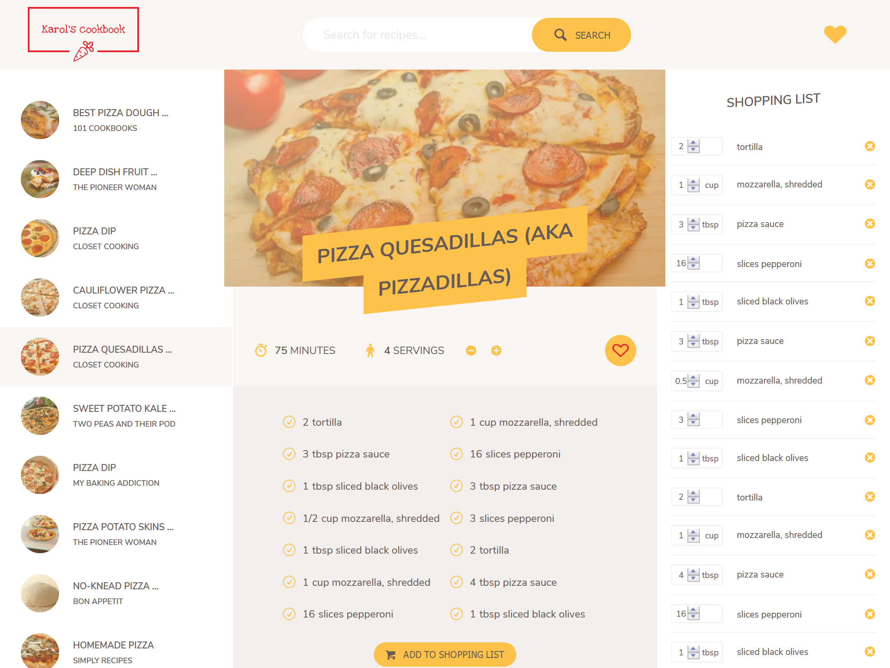
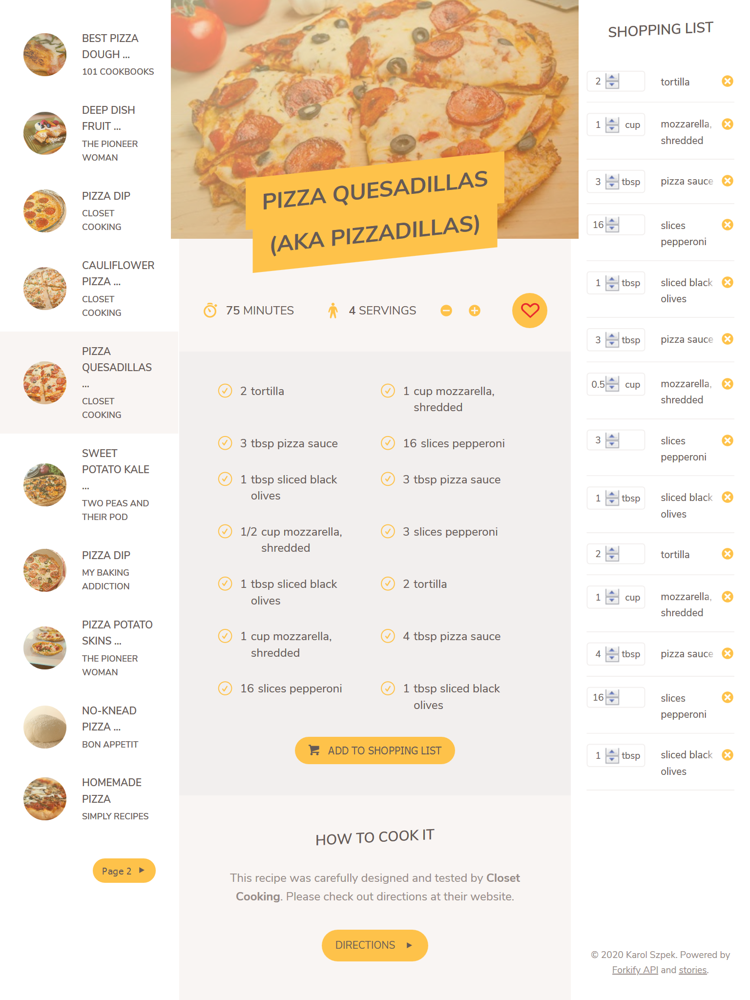
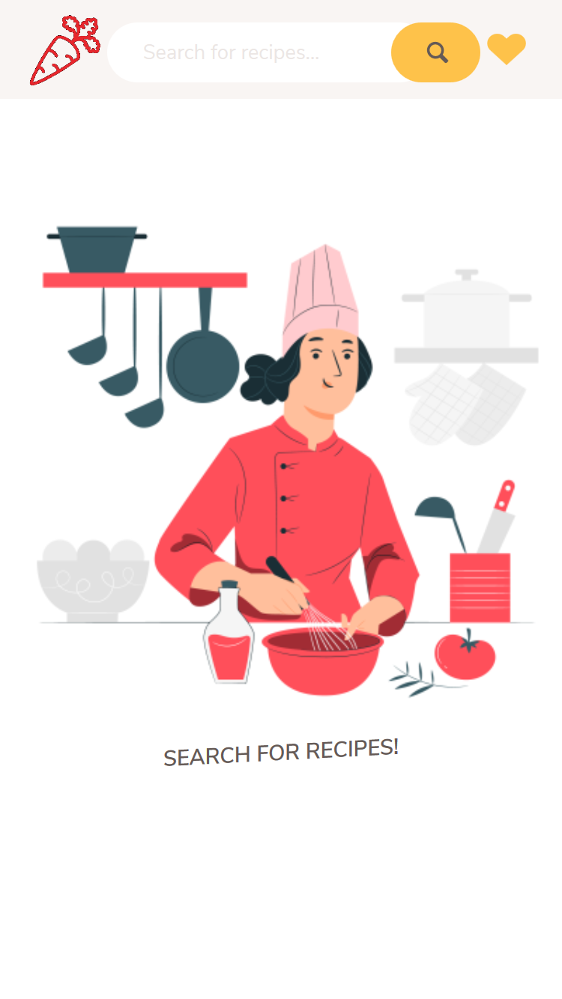
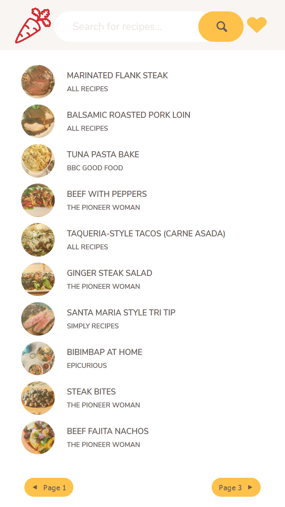
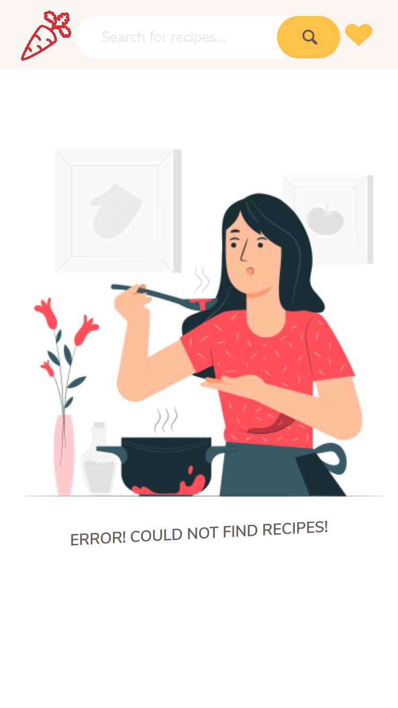
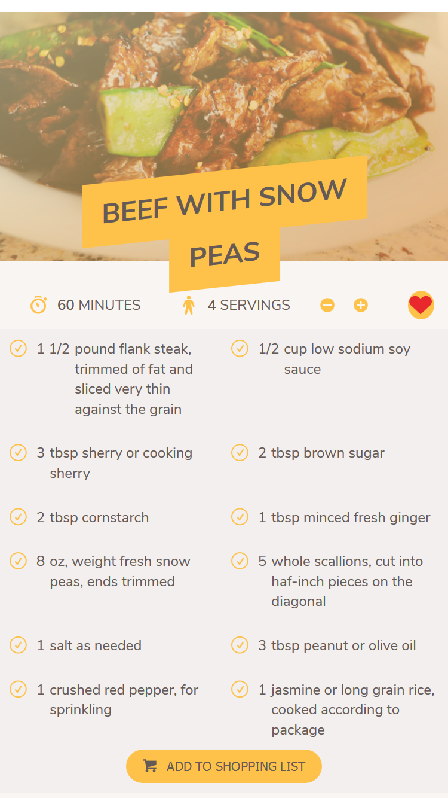
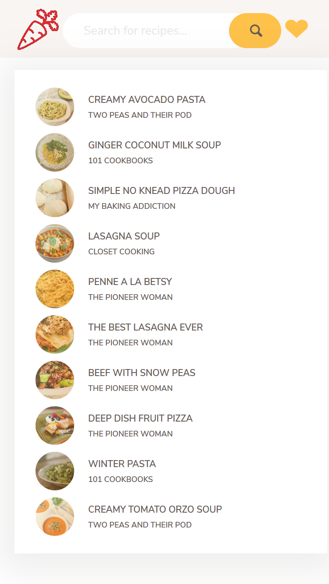
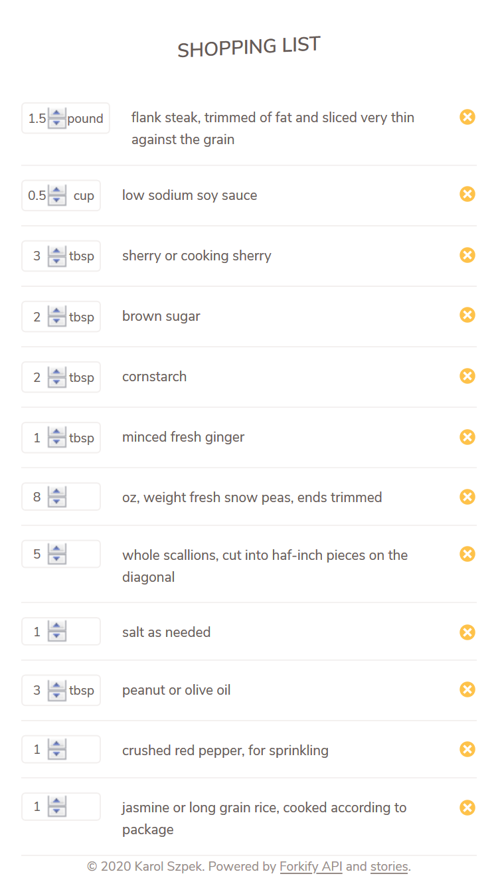

# Cookbook web application

## 1. LIVE DEMO: https://karolsz15.github.io/cookbook/

## 2. DESCRIPTION

Cookbook web application containing hundreds of recipes. User is able to:

- search for recipes
- change amount of ingredients depending on number of servings
- add favourite recipes to liked recipes list by clicking the heart button
- unlike previously liked recipes
- go to author's page for further directions
- add ingredients to a shopping list
- add or subtract amounts of selected ingredients from the shopping list
- delete selected ingredients from the shopping list

The app gets data from a Forkify API - https://forkify-api.herokuapp.com/ .  
List of all available search queries is here - https://forkify-api.herokuapp.com/phrases.html .  
The page is fully responsive, it works properly on tablets and mobile phones (tested on iPad's and iPhones resolutions).  

## 3. SCREENSHOTS:

### 1. Desktop home view
 

### 2. Desktop recipe view
 

### 3. Desktop ingredients list view
 

### 4. Tablet landscape orientation view
 

### 5. Tablet portrait orientation view
 

### 6. Phone portrait orientation - homepage
 

### 7. Phone portrait orientation - recipe search
 

### 8. Phone portrait orientation - search error
 

### 9. Phone portrait orientation - recipe
 

### 10. Phone portrait orientation - popup likes list
 

### 11. Phone portrait orientation - shopping list
 

