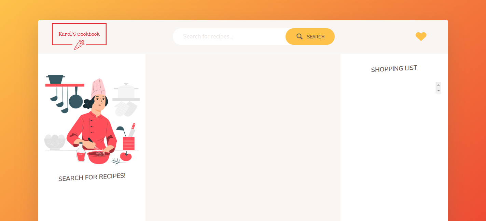

Cookbook web application containing hundreds of recipes. User is able to:

- search for recipes
- change amount of ingredients depending on number of servings
- add favourite recipes to liked recipes list by clicking the heart button
- unlike previously liked recipes
- go to author's page for further directions
- add ingredients to a shopping list
- add or subtract amounts of selected ingredients from the shopping list
- delete selected ingredients from the shopping list

The app gets data from a Forkify API - https://forkify-api.herokuapp.com/ .
List of all available search queries is here - https://forkify-api.herokuapp.com/phrases.html .
The page is fully responsive, it works properly on tablets and mobile phones (tested on iPad's and iPhones resolutions).

 <!-- .element height="50%" width="50%" -->
 <!-- .element height="50%" width="50%" -->

 <!-- .element height="50%" width="50%" -->
 <!-- .element height="50%" width="50%" -->
 <!-- .element height="50%" width="50%" -->
 <!-- .element height="50%" width="50%" -->
 <!-- .element height="50%" width="50%" -->
 <!-- .element height="50%" width="50%" -->

